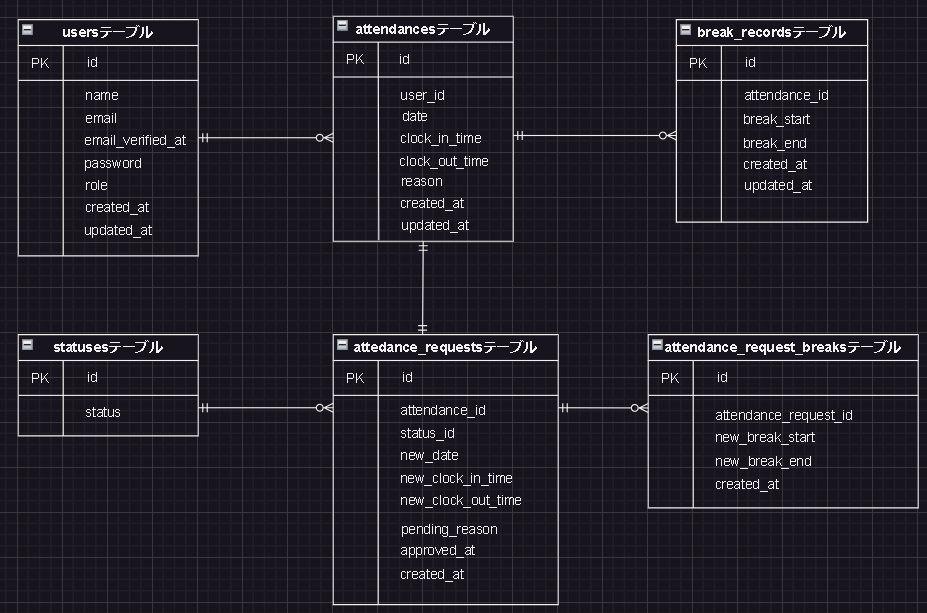

# attendance-app

# 環境構築
Dockerビルド <br>
・Dockerを起動する
・git clone https://github.com/sakura693/attendance-app <br>
・docker-compose up -d --build

# Laravel開発環境
1. docker-compose exec php bash
2. composer install
3. .envに以下の環境変数を追加 <br>
```
    DB_CONNECTION=mysql <br>
    DB_HOST=mysql <br>
    DB_PORT=3306 <br>
    DB_DATABASE=laravel_db <br>
    DB_USERNAME=laravel_user <br>
    DB_PASSWORD=laravel_pass <br>
```
4. php artisan key:generate <br>
5. php artisan migrate <br>
6. php artisan db:seed

# メール認証
mailtrapというツールを使用しています。</br>
以下のリンクから会員登録を行ってください。</br>
https://mailtrap.io/

Email Testingで新規メールボックスを作成してください。</br>
そして、メールボックスのIntegrationから「Laravel 7.x and 8.x」を選択し、.envファイルにMAIL_MAILERからMAIL_ENCRYPTIONまでの項目をコピー＆ペーストしてください。</br>
MAIL_FROM_ADDRESSは任意のメールアドレスを入力してください。　

# PHPUnitを利用したテストに関して
以下のコマンド：
```
php artisan key:generate --env=testing
docker-compose exec php bash
php artisan migrate:fresh --env=testing
vendor/bin/phpunit tests/Feature/テストファイル名
```

# 開発環境
・ログイン画面: http://localost/login <br>
・phpmyadmin: http://localhost:8080/

# 使用技術（実行環境）
・PHP 8.3.9 <br>
・Laravel 8.83.29 <br>
・MySQL 8.0.26 <br>
・nginx 1.18.0

# ER図

